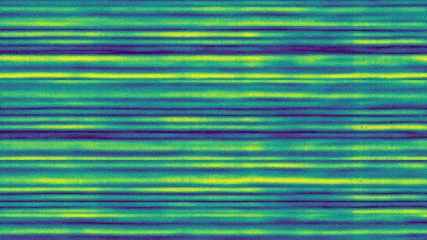
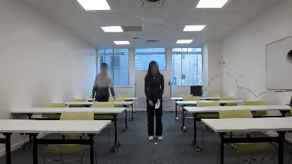
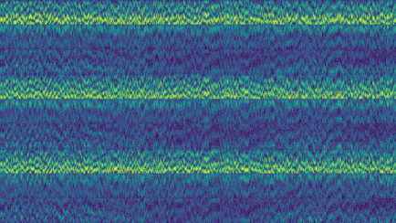
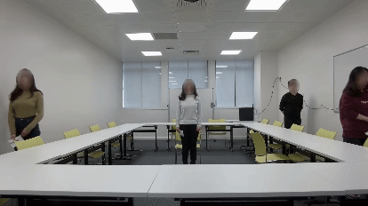
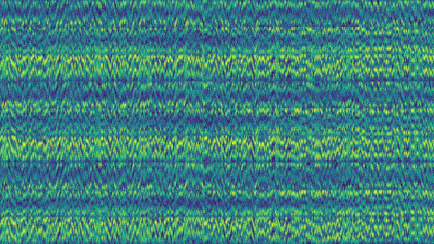
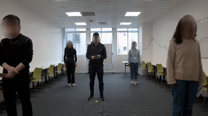

# WiMANS: A Benchmark Dataset for WiFi-based Multi-user Activity Sensing

<p align="center">
  <a href="#Introduction">Introduction</a> |
  <a href="#Environment">Environment</a> |
  <a href="#Dataset">Dataset</a> |
  <a href="#Experiments">Experiments</a> |
  <a href="#Contact-Us">Contact Us</a>
</p>

## Introduction

This repository presents WiMANS, including [the entire dataset](https://www.kaggle.com/datasets/c4ecbbf66f200ced9ad8b7d2e3c0371c6e615ef2ee203174f09bcefb7a12d523), source code, and documents. To the best of our knowledge, WiMANS is the first WiFi-based **multi-user** activity sensing dataset based on WiFi Channel State Information (CSI). WiMANS contains 11286 CSI samples of dual WiFi bands (2.4 / 5 GHz) and synchronized videos for reference and unexplored tasks (e.g., multi-user pose estimation). Each 3-second sample includes 0 to 5 users performing identical/different activities simultaneously, annotated with (anonymized) user identities, locations, and activities.

<table align = "center">
  <tr align = "center"><td rowspan="2"> <b>Sample <br/> "act_30_25" </b></td><td>WiFi CSI (5GHz)</td> <td>Synchronized Video</td></tr>
  <tr align = "center"><td></td><td></td></tr>
</table>

<table align = "center">
  <tr align = "center"><td rowspan="2"> <b>Sample <br/> "act_49_41"</b></td><td>WiFi CSI (2.4GHz)</td> <td>Synchronized Video</td></tr>
  <tr align = "center"><td></td><td></td></tr>
</table>

<table align = "center">
  <tr align = "center"><td rowspan="2"> <b>Sample <br/> "act_88_30" </b></td><td>WiFi CSI (2.4GHz)</td> <td>Synchronized Video</td></tr>
  <tr align = "center"><td></td><td></td></tr>
</table>


## Environment

- Ubuntu 20.04
- Python 3.9.12
- SciPy 1.7.3
- NumPy 1.21.5
- Pandas 1.4.2
- PyTorch 2.0.1

We suggest to create the environment by installing `environment.yml` with [Anaconda](https://www.anaconda.com/).

```sh
git clone https://github.com/huangshk/WiMANS.git
cd WiMANS
conda env create -f environment.yml
```


## Dataset

Please download the WiMANS dataset and extract it under the `dataset` directory.

- Step 1: Download the WiMANS dataset from [[Kaggle]](https://www.kaggle.com/datasets/c4ecbbf66f200ced9ad8b7d2e3c0371c6e615ef2ee203174f09bcefb7a12d523)

- Step 2: Extract the entire WiMANS dataset under this directory

  ```sh
  upzip dataset.zip
  ```

- Step 3: Make sure the extracted WiMANS dataset follows such a file structure

    ```
    dataset
    | - README.md
    | - annotation.csv        # labels, annotations (e.g., user identities, locations, activities)
    | - wifi_csi
    |   | - mat
    |   |   |   act_1_1.mat   # raw CSI sample labeled "act_1_1"
    |   |   |   act_1_2.mat   # raw CSI sample labeled "act_1_2"
    |   |   |   ...           # totally 11286 raw CSI samples (*.mat files)
    |   | - amp
    |   |   |   act_1_1.npy   # CSI amplitude labeled "act_1_1"
    |   |   |   act_1_2.npy   # CSI amplitude labeled "act_1_2"
    |   |   |   ...           # totally 11286 samples of CSI amplitude (*.npy files)
    | - video
    |   | - act_1_1.mp4       # video sample labeled "act_1_1"
    |   | - act_1_2.mp4       # video sample labeled "act_1_2"
    |   | - ...               # totally 11286 video samples (*.mp4 files)
    ```

Annotations are saved in the "annotation.csv" file, which can be read using Pandas.

```python
import pandas as pd
data_pd_y = pd.read_csv(var_path_data_y, dtype = str)    # "var_path_data_y" is the path of "annotation.csv"
```

Raw CSI data are saved in "*.mat" files, which can be read using SciPy.

```python
import scipy.io as scio
data_mat = scio.loadmat(var_path_mat)    # "var_path_mat" is the path of "*.mat" file
```

The preprocessed data of CSI amplitude are saved in "*.npy" files, which can be read using NumPy.

```python
import numpy as np
data_csi = np.load(var_path)    # "var_path" is the path of "*.ny" file
```

Video data are saved in "*.mp4" files, which can be read using PyTorch.

```python
import torchvision
data_video_x, _, _ = torchvision.io.read_video(var_path, output_format = "TCHW")    # "var_path" is the path of "*.mp4" file
```


## Experiments

The source code of benchmark experiments is under the `benchmark` directory.

### WiFi-based Models

#### Data Preparation

Edit `benchmark/wifi_csi/preset.py` to select the number(s) of users, WiFi band(s), and environment(s).

```python
preset = {
    ...
    "data": {
        "num_users": ["0", "1", "2", "3", "4", "5"],# e.g., ["0", "1"], ["2", "3", "4", "5"]
        "wifi_band": ["2.4"],                       # e.g., ["2.4"], ["5"], ["2.4", "5"]
        "environment": ["classroom"],               # e.g., ["classroom"], ["meeting_room"], ["empty_room"]
        ...
    },
    ...
}
```

(Optional) We use `benchmark/wifi_csi/preprocess.py` to calculating  the amplitude of raw WiFi CSI. `--dir_mat` defines the input directory of raw WiFi CSI. `--dir_amp` defines the output directory of CSI amplitude. The following code uses the raw WiFi CSI in `dataset/wifi_csi/mat` to calculate the amplitude and save the amplitude files to `dataset/wifi_csi/amp`.

```sh
python benchmark/wifi_csi/preprocess.py --dir_mat="dataset/wifi_csi/mat" --dir_amp="dataset/wifi_csi/amp"
```

Note that this step is optional because we have already provided the preprocessed data in the `dataset/wifi_csi/amp` directory.

#### Run Experiments

Edit `benchmark/wifi_csi/preset.py` to set data directory and to tune the hyperparameters, including the learning rate, batch size, etc.

Use `benchmark/wifi_csi/run.py` to run experiments for WiFi-based models. `--model` defines the WiFi-based model for experiments. `--task` defines the human sensing task to evaluate. `--repeat` defines the number of repeated experiments. If these arguments are not provided, models will load the default settings in `benchmark/wifi_csi/preset.py`.

- `--model`: "ST-RF", "MLP", "LSTM", "CNN-1D", "CNN-2D", "CLSTM", "ABLSTM", "THAT"
- `--task`: "identity", "location", "activity"

The following code repeats experiments 10 times to run the MLP model for WiFi-based human activity recognition.


```sh
python benchmark/wifi_csi/run.py --model="MLP" --task="activity" --repeat=10
```

After experiments, the results will be saved in the `result.json` file, which can be modified in `benchmark/wifi_csi/preset.py`.

### Video-based Models

#### Data Preparation

Edit `benchmark/video/preset.py` to select the number(s) of users and environment(s).

```python
preset = {
    ...
    "data": {
        "num_users": ["0", "1", "2", "3", "4", "5"],    # e.g., ["0", "1"], ["2", "3", "4", "5"]
        "environment": ["classroom"],                   # e.g., ["classroom"], ["meeting_room"], ["empty_room"]
    },
    ...
}
```

We preprocess video data according to the original paper of video-based models. `--path_data_x` defines the input directory of raw videos. `--path_data_y` defines the input directory of labels. `--model` defines the model for which the videos should be preprocessed. `--path_data_pre_x` defines the output directory of preprocessed videos (*.npy).

- `--model`: "ResNet", "S3D", "MViT-v1", "MViT-v2", "Swin-T", "Swin-S"

The following code preprocesses videos in `dataset/video` for the ResNet model and save preprocessed files to `dataset/cache`.

```sh
python benchmark/video/preprocess.py --path_data_x="dataset/video" --path_data_y="dataset/annotation.csv" --model="ResNet" --path_data_pre_x="dataset/cache"
```

#### Run Experiments

Edit `benchmark/video/preset.py` to set data directory and to tune the hyperparameters, including the learning rate, batch size, etc.

Use `benchmark/video/run.py` to run experiments for video-based models. `--model` defines the video-based model for experiments. `--task` defines the human sensing task to evaluate. `--repeat` defines the number of repeated experiments. If these arguments are not provided, models will load the default settings in `benchmark/video/preset.py`.

- `--model`: "ResNet", "S3D", "MViT-v1", "MViT-v2", "Swin-T", "Swin-S"
- `--task`: "identity", "location", "activity"

The following code repeats experiments 10 times to run the ResNet model for video-based human activity recognition.

```sh
python benchmark/video/run.py --model="ResNet" --task="activity" --repeat=10
```

After experiments, the results will be saved in the `result.json` file, which can be modified in `benchmark/video/preset.py`.


## Contact Us

Please feel free to contact us if you have any questions about WiMANS.

- Shuokang Huang: s.huang21@imperial.ac.uk
- Professor Julie McCann: j.mccann@imperial.ac.uk
